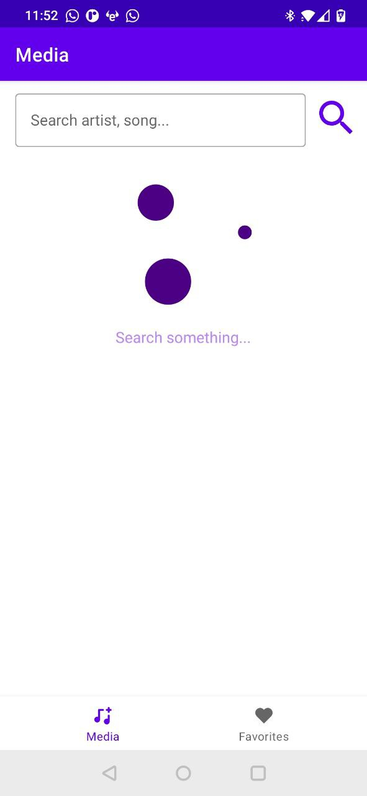
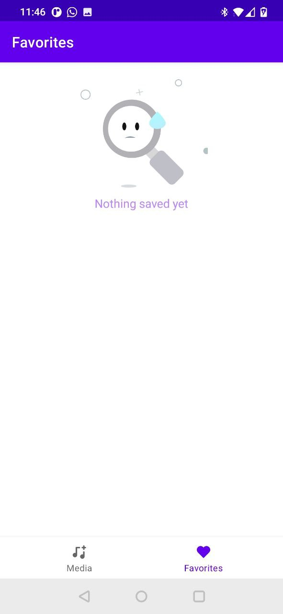
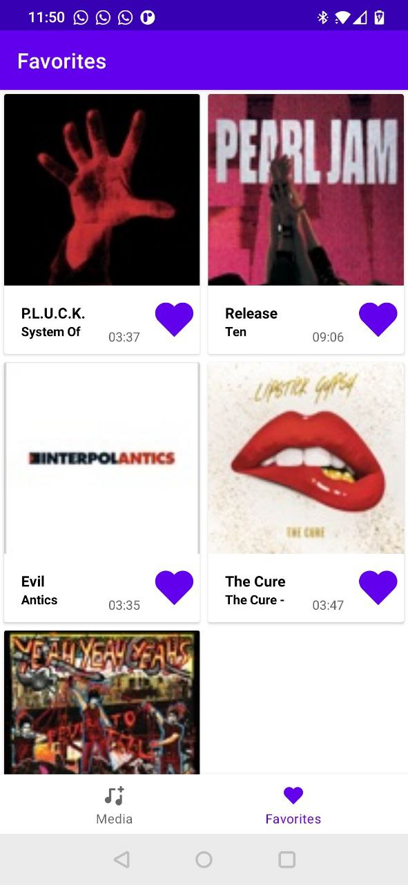
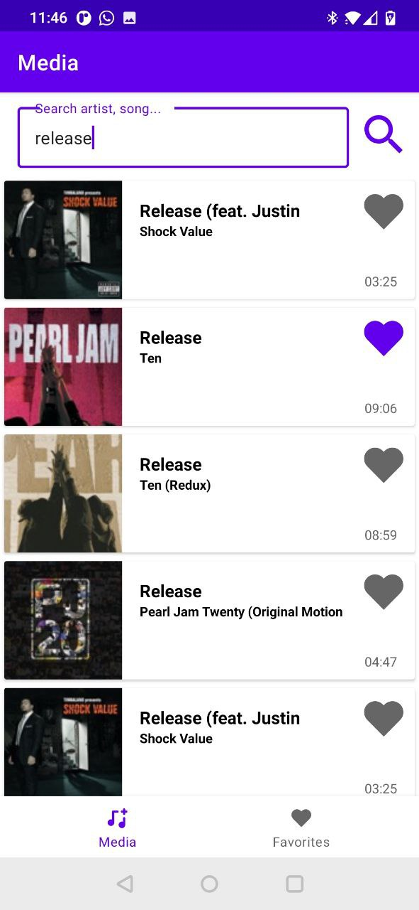

# Musical Heart Android App
---------------------------
|  | The Musical Heart App is an Android app created to show a multimodule project with Kotlin + clean architecture + SOLID + MVVM |
| -- | -- |
| M. Fowler | “If you can get today’s work done today, but you do it in such a way that you can’t possibly get tomorrow’s work done tomorrow, then you lose.” |

## Screenshots
   

## Stack
- Rx Android 3 / Rx Java 3
- Dagger 2 (di layer)
- MVVM jet pack design pattern library
- ROOM (data persistence)
- Retrofit + Okhttp (Network client / API Rest)
- Timber (logger)
- Glide (image loading framework)
- Lottie (Adobe after effects animations for android)

## Contributors
Name | Contact
:---: | :---:
[Gustavo Pedreros](https://github.com/gustavo-pedreros) |  [gustravo.pedreros@gmail.com](mailto:gustravo.pedreros@gmail.com)
